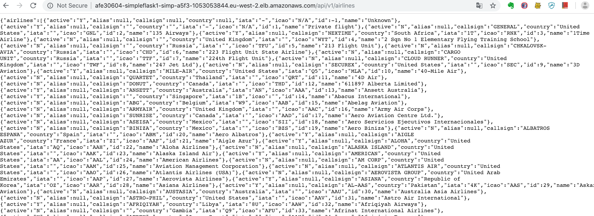

# A simple rest api to load airlines data into a DB

Just playing around with flask while connecting to a PostGreSQL DB with a single table containing information about airlines.

## Curling around

### Loading the Airlines database from https://raw.githubusercontent.com/jpatokal/openflights/master/data/airlines.dat

    curl -vvvX  POST curl -X POST http://afe30604-simpleflask1-simp-a5f3-1053053844.eu-west-2.elb.amazonaws.com/api/v1/load/airlines
    

    
### Listing all airlines

    curl -v  http://afe30604-simpleflask1-simp-a5f3-1053053844.eu-west-2.elb.amazonaws.com/api/v1/airlines/
   

   

### Get a specific airline by id

    curl -v  http://afe30604-simpleflask1-simp-a5f3-1053053844.eu-west-2.elb.amazonaws.com/api/v1/airlines/4
    

## Database notes

The app requires an existing instance of PostGREs, with the tables defined as per models.py.
The tables can be created, for example, using the Flask shell:

    $ flask shell
    >>> from app import db
    >>> db.create_all()
    >>> from app.models  import Airline
    >>> Airlines.query.all()
    
No DB migrations are implemented yet.

